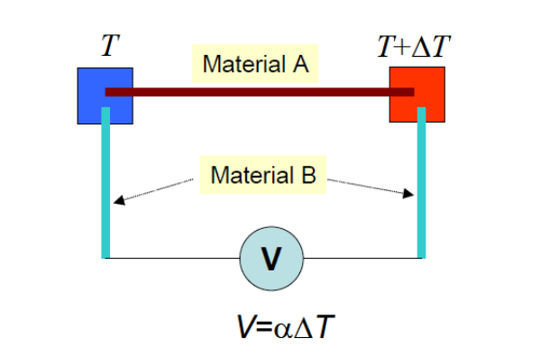
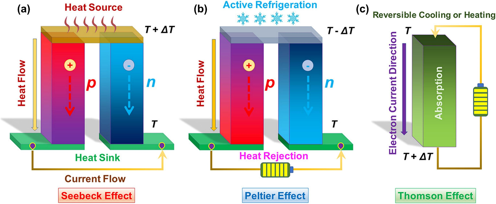

# Thermoelectric-devices-research

This document contain research conducted on Thermoelectric device as my capstone project.

# Content 

1. Matherials/ Equipment 
2. Theory
3. Experiment

# Materials/ Equipment

1. Thermoelectric Module
2. Integrated DC/DC converter 
        Datasheet: https://www.google.com/url?sa=t&source=web&rct=j&opi=89978449&url=https://www.analog.com/media/en/technical-documentation/data-sheets/LTC3108.pdf&ved=2ahUKEwiahpjd7eOPAxV1rlYBHaN8NcAQFnoECAsQAQ&usg=AOvVaw0LooazdJWBSNLzo-ye4eUZ

3. Breadboard
4. Multimeter
5. Power Supply 
6. Transformer
    Source: https://www.coilcraft.com/en-us/products/power/coupled-inductors/1-n-shielded-coupled/lpr/lpr6235/lpr6235-752r/?srsltid=AfmBOopEkPoNorhlWwUxvnun_wpW5BROGs27PXitI0_5nXwgn1OlerQR


# Thermoelectric Effects Theory

## Introduction

Thermoelectric devices operate based on fundamental physical phenomena that enable direct conversion between thermal and electrical energy. These devices exhibit bidirectional functionality through two primary effects: the Seebeck effect (thermal to electrical) and the Peltier effect (electrical to thermal).
## The Seebeck Effect

The Seebeck effect was discovered by **Thomas Johann Seebeck** in 1821. It describes the generation of an electric voltage when a temperature difference is applied across a thermoelectric material or junction of dissimilar materials.



> A diagram showing Seebeck effect. The temperature difference between the two junctions is ΔT.

The thermoelectric voltage (V) generated is given by equation,

$𝑽 = (𝑺𝑨 − 𝑺𝑩)\Delta T$

where 𝑆𝐴 and 𝑆𝐵 are the Seebeck coefficients of the materials A and B, respectively, and 𝛥T is the temperature difference between the junctions. [Source](https://arxiv.org/pdf/1704.07742)

### Physical Mechanism

When heat is applied to one end of a thermoelectric material:

1. **Charge Carrier Excitation**: Thermal energy increases the kinetic energy of charge carriers (electrons in n-type materials, holes in p-type materials)
2. **Diffusion Process**: Higher energy charge carriers diffuse from the hot side toward the cold side
3. **Potential Development**: This migration creates a concentration gradient and establishes an electric potential difference
4. **Voltage Generation**: The accumulated charges create a measurable voltage across the material

### Mathematical Relationship

The Seebeck effect follows the relationship:

```
V = α × ΔT
```

Where:
- **V** = Generated voltage (volts)
- **α** = Seebeck coefficient (μV/K)
- **ΔT** = Temperature difference between hot and cold sides (K)

### Seebeck Coefficient

The Seebeck coefficient (α) is a material property that indicates:
- The magnitude of voltage generated per unit temperature difference
- The polarity of the generated voltage
- Typical values range from -200 to +200 μV/K for good thermoelectric materials

## The Peltier Effect

The Peltier effect was discovered by Jean Charles Athanase Peltier in 1834. It describes the heating or cooling that occurs at a junction when electric current flows through it.

### Physical Mechanism

When current flows through a thermoelectric junction:

1. **Current Application**: External electrical energy drives charge carriers through the material
2. **Energy Transfer**: Charge carriers either gain or lose energy when crossing the junction
3. **Heat Exchange**: Energy changes manifest as heat absorption or rejection at the junction
4. **Temperature Change**: One side becomes hot while the other becomes cold

### Mathematical Relationship

The Peltier effect follows the relationship:

```
Q = Π × I
```

Where:
- **Q** = Heat absorbed or released (watts)
- **Π** = Peltier coefficient (volts)
- **I** = Applied current (amperes)

### Peltier Coefficient

The Peltier coefficient (Π) is related to the Seebeck coefficient by:

```
Π = α × T
```

Where T is the absolute temperature (K).

## Thomson Effect

### Definition

The Thomson effect, discovered by William Thomson (Lord Kelvin), describes the heating or cooling that occurs when current flows through a conductor with a temperature gradient.

### Mathematical Relationship

```
Q = β × I × ∇T
```

Where:
- **β** = Thomson coefficient
- **∇T** = Temperature gradient




[Source](https://www.sciencedirect.com/science/article/pii/S019689042500144X)
## Material Properties and Requirements

### Key Material Characteristics

Effective thermoelectric materials must possess:

1. **High Seebeck Coefficient (α)**: Maximizes voltage generation per unit temperature difference
2. **High Electrical Conductivity (σ)**: Minimizes resistive losses
3. **Low Thermal Conductivity (κ)**: Maintains temperature gradient across the device

### Figure of Merit

The thermoelectric figure of merit quantifies material performance:

```
ZT = (α² × σ × T) / κ
```

Where:
- **Z** = Figure of merit (K⁻¹)
- **T** = Absolute temperature (K)
- Higher ZT values indicate better thermoelectric performance

### Common Thermoelectric Materials

| Material | Temperature Range | ZT Value | Applications |
|----------|-------------------|----------|--------------|
| Bi₂Te₃ | Room temperature | 0.8-1.2 | Cooling, low-temp power |
| PbTe | 400-700K | 1.4-2.2 | Medium-temp power generation |
| SiGe | 700-1300K | 0.7-1.3 | High-temp space applications |
| Skutterudites | 400-800K | 1.2-1.8 | Automotive waste heat recovery |

## Device Design and Configuration

### Thermocouple Construction

Basic thermoelectric devices consist of:
- **P-type leg**: Material with positive Seebeck coefficient
- **N-type leg**: Material with negative Seebeck coefficient
- **Electrical interconnects**: Copper strips connecting the legs
- **Ceramic substrates**: Electrical insulation and heat transfer

### Module Assembly

Commercial thermoelectric modules feature:
- Multiple thermocouples connected electrically in series
- Thermal parallel configuration to maintain uniform temperature
- Ceramic plates (alumina) for electrical insulation
- Optimized leg geometry for maximum performance


## Efficiency Considerations

### Theoretical Limits

The maximum theoretical efficiency of a thermoelectric generator is given by:

```
η_max = η_Carnot × √(1+ZT) - 1 / √(1+ZT) + T_c/T_h
```

Where:
- **η_Carnot** = Carnot efficiency = (T_h - T_c)/T_h
- **T_h** = Hot side temperature (K)
- **T_c** = Cold side temperature (K)

### Practical Efficiency

Current commercial thermoelectric devices achieve:
- **Generators**: 5-8% efficiency
- **Coolers**: COP of 0.3-0.6
- **Research targets**: 15-20% efficiency with advanced materials

## Advantages and Limitations

### Advantages

- **Solid-state operation**: No moving parts, silent operation
- **Reliability**: Long operational life with minimal maintenance
- **Scalability**: Can be sized from milliwatts to kilowatts
- **Bidirectional**: Same device can generate power or provide cooling
- **Fast response**: Rapid thermal response times

### Limitations

- **Low efficiency**: Significantly lower than conventional heat engines
- **Cost**: High-performance materials are expensive
- **Temperature limitations**: Material properties degrade at extreme temperatures
- **Thermal management**: Requires effective heat sinking


# Experimental Results


Initial experiment was to provide understanding on the limitation, and efficient point of the Thermoelectric device that will be used throught.


The experiment conducted here was to measure the  voltage egerated by the thermoelectric device as we increase the heat on one side of the thermoelectric device.

It can be seen from the graph that the most voltage generated is 